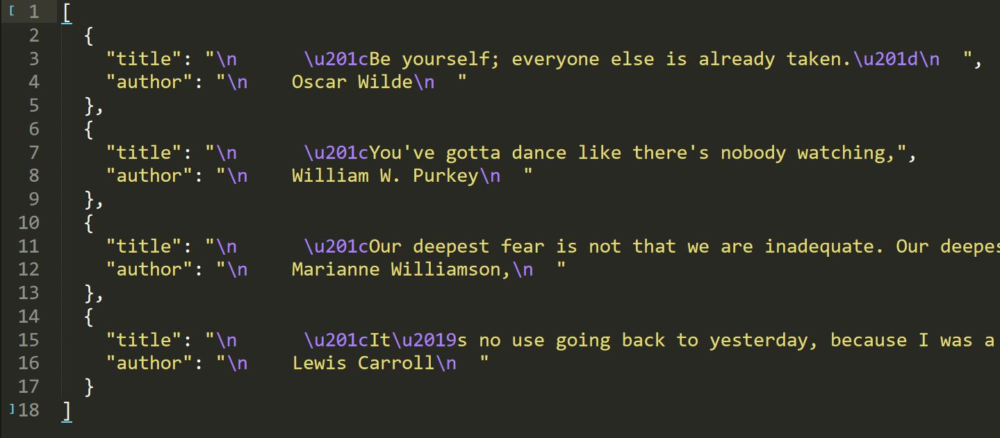

## **QuotesScrapy**
This scraper is based on the scrapy framework with pagination feature. It uses fake user agents to bypass the security.

Steps to run the projects:-
1. Activate virtual env with `. env/bin/activate`
2. Install requirements using `pip install -r requirements.txt`
3. Run the following commands:-
<br>`scrapy crawl QuotesScraper`

<h3>Topics -> scrapy-framework, python, scraping</h3>

<h5>Source Code Link -> <u><a href="https://github.com/chaudharypraveen98/QuotesTutorial">GitHub</a></u></h5>

<strong>What We are going to do?</strong>
<ol>
    <li>Setting up the Scrapy Project</li>
    <li>Writing a Scraper to scrapes quotes</li>
    <li>Cleaning and Pipelining to store data in sqlite3 database</li>
    <li>Setting up Fake user agents and proxies</li>
</ol>

## Step 1 -> Setting up the Scrapy Project  

<h3>Creating a QuotesTutorial project</h3>

<strong>Before creating , we must know about <b>Scrapy</b></strong>

Scrapy is a free and open-source web-crawling framework written in Python. Originally designed for web scraping, it can also be used to extract data using APIs or as a general-purpose web crawler.

To initialize the project

```scrapy startproject quotes-tutorial```

This will create a tutorial directory with the following contents:

```
quotes-tutorial/
scrapy.cfg            # deploy configuration file

quotes-tutorial/             # project's Python module, you'll import your code from here
__init__.py

items.py          # project items definition file

middlewares.py    # project middlewares file

pipelines.py      # project pipelines file

settings.py       # project settings file

spiders/          # a directory where you'll later put your spiders
__init__.py
```

## Step 2 -> Writing our scraper  

It will extract quotes from <a href="https://www.goodreads.com">Good Reads website</a>

<b>Before moving ahead , we must be aware of the selectors</b>

<strong>What are selectors/locators?</strong>

A CSS Selector is a combination of an element selector and a value which identifies the web element within a web page.

<b>The choice of locator depends largely on your Application Under Test</b>

<b>Id</b>
An element’s id in XPATH is defined using: “[@id='example']” and in CSS using: “#” - ID's must be unique within the DOM.
Examples:

```
XPath: //div[@id='example']
CSS: #example
```

<b>Element Type</b>
The previous example showed //div in the xpath. That is the element type, which could be input for a text box or button, img for an image, or "a" for a link. 

```
Xpath: //input or
Css: =input
```

<b>Direct Child</b>
HTML pages are structured like XML, with children nested inside of parents. If you can locate, for example, the first link within a div, you can construct a string to reach it. A direct child in XPATH is defined by the use of a “/“, while on CSS, it’s defined using “>”. 
Examples:

```                        
XPath: //div/a
CSS: div > a
```

<b>Child or Sub-Child</b>
Writing nested divs can get tiring - and result in code that is brittle. Sometimes you expect the code to change, or want to skip layers. If an element could be inside another or one of its children, it’s defined in XPATH using “//” and in CSS just by a whitespace.
Examples:

```
XPath: //div//a
CSS: div a
```

<b>Class</b>
For classes, things are pretty similar in XPATH: “[@class='example']” while in CSS it’s just “.” 
Examples:

```
XPath: //div[@class='example']
CSS: .example
```
We have inherited the spider class from scrapy-framework. The <tt>page_number</tt> is the next page to be scraped
<tt>start_urls</tt> provide the entry point to the scraper if no url is explicitly given.
<tt>_parse</tt> function is main function from where the scraping starts.
We have used the css selectors explained above.

```
import scrapy

from ..items import QuotesItem


class QuotesScraper(scrapy.Spider):
page_number = 2
name = "QuotesScraper"
start_urls = ["https://www.goodreads.com/quotes/tag/inspirational"]

def _parse(self, response, **kwargs):
item = QuotesItem()
for quote in response.css(".quote"):
title = quote.css(".quoteText::text").extract_first()
author = quote.css(".authorOrTitle::text").extract_first()
item["title"] = title
item["author"] = author
yield item

# Uncomment the below lines if you want to scrape all the pages in that website and comment the rest uncomment line

# next_btn = response.css("a.next_page::attr(href)").get()
# if next_btn is not None:
#     yield response.follow(next_btn, callback=self._parse())
next_page=f"https://www.goodreads.com/quotes/tag/inspirational?page={QuotesScraper.page_number}"
if QuotesScraper.page_number < 3:
QuotesScraper.page_number += 1
yield response.follow(next_page, callback=self._parse)
```

<strong>But what are QuotesItem here?</strong>

Items are containers that will be loaded with the scraped data; they work like simple python dicts but provide additional protection against populating undeclared fields, to prevent typos.

```
import scrapy


class QuotesItem(scrapy.Item):
# define the fields for your item here like:
title = scrapy.Field()
author = scrapy.Field()
```

## Step 3 -> Pipelining to store the data in sqlite3 database  

```
import sqlite3


class QuotesPipeline:
def __init__(self):
self.create_connection()
self.create_table()

def process_item(self, item, spider):
self.db_store(item)
return item

def create_connection(self):
self.conn = sqlite3.connect("quotes.db")
self.curr = self.conn.cursor()

def create_table(self):
self.curr.execute("""DROP TABLE IF EXISTS quote_table""")
self.curr.execute("""create table quote_table( title text, author text)""")

def db_store(self, item):
self.curr.execute("""insert into quote_table values(?,?)""", (
item["title"],
item["author"]
))
self.conn.commit()
```
Initiate a **QuotesPipeline** Class. 

<tt>__init__</tt> functions creates a connection between the sqlite3 database and the program with the help of <tt>create_connection</tt> function. It is also responsible for creating a Quotes table with the <tt>create_table</tt> function.
<tt>process_item</tt> function will process all the quotes items and will store into the database with the help of <tt>db_store</tt> function.                    

## Step 4 -> Setting up Fake user agents and proxies  
As we are scraping on a large scale we need to avoid banning our IP
We are using two libraries : -
<ol>
    <li><a href="https://github.com/rejoiceinhope/scrapy-proxy-pool">scrapy-proxy-pool</a></li>
    <li><a href="https://pypi.org/project/scrapy-user-agents/">scrapy-user-agents</a></li>
</ol>
<strong>1. scrapy-proxy-pool</strong>
It will provide a bunch of proxies to ensure security of our real IP.

Enable this middleware by adding the following settings to your settings.py:

```PROXY_POOL_ENABLED = True```

Then add rotating_proxies middlewares to your DOWNLOADER_MIDDLEWARES:

```
DOWNLOADER_MIDDLEWARES = {
# ...
'scrapy_proxy_pool.middlewares.ProxyPoolMiddleware': 610,
'scrapy_proxy_pool.middlewares.BanDetectionMiddleware': 620,
# ...
}
```

After this all requests will be proxied using proxies.

<strong>2. scrapy-user-agents</strong>

Random User-Agent middleware picks up User-Agent strings based on Python User Agents and MDN.

Turn off the built-in UserAgentMiddleware and add RandomUserAgentMiddleware.

```
DOWNLOADER_MIDDLEWARES = {
'scrapy.downloadermiddlewares.useragent.UserAgentMiddleware': None,
'scrapy_user_agents.middlewares.RandomUserAgentMiddleware': 400,
}
```

## Deployment  
Running Scrapy spiders in your local machine is very convenient for the (early) development stage, but not so much when you need to execute long-running spiders or move spiders to run in production continuously. This is where the solutions for deploying Scrapy spiders come in.

Popular choices for deploying Scrapy spiders are:
<ol>
    <li><a href="https://github.com/scrapy/scrapyd">Scrapyd (open source)</a></li>
    <li><a href="https://www.zyte.com/scrapy-cloud">Zyte Scrapy Cloud (cloud-based)</a></li>
</ol>

## Web Preview / Output  
<a href="quotes.JPG"></a>
<span class="caption text-muted">Web preview on deployment</span>

Placeholder text by <a href="https://chaudharypraveen98.github.io/">Praveen Chaudhary</a>&middot; Images by<a href="hhttps://chaudharypraveen98.github.io/binarybeast/">Binary Beast</a>